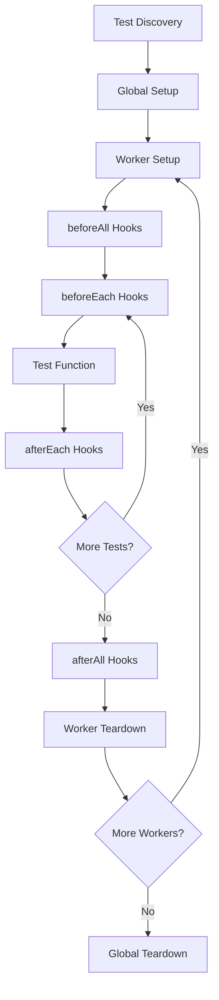

## Introduction

Playwright Test Runner is a full-featured test runner designed specifically for end-to-end testing. It provides a robust test execution engine with built-in parallelization, retries, fixtures, and reporters.

## Core Concepts

### Test Structure

Playwright organizes tests in a hierarchical structure:

```typescript
import { test, expect } from '@playwright/test';

test.describe('Feature Suite', () => {
  test('should perform action', async ({ page }) => {
    await page.goto('https://example.com');
    await expect(page).toHaveTitle(/Example/);
  });
});
```

**Key Components:**

- **Root Suite**: Top-level container for all tests
- **Project Suite**: Groups tests by project configuration
- **File Suite**: Represents a single test file
- **Describe Blocks**: Logical groupings within files
- **Test Cases**: Individual test functions

From the source code (`src/common/test.ts:45-70`):

```typescript
class Suite extends Base {
  location?: Location;
  parent?: Suite;
  _entries: (Suite | TestCase)[] = [];
  _hooks: { type: 'beforeEach' | 'afterEach' | 'beforeAll' | 'afterAll' }[] = [];
  readonly _type: 'root' | 'project' | 'file' | 'describe';
}
```

### Test Execution Model

The test runner executes tests through several phases:

1. **Configuration Loading**: Loads and validates `playwright.config.ts`
2. **Test Discovery**: Scans for test files matching patterns
3. **Test Compilation**: Transpiles TypeScript/JSX to JavaScript
4. **Worker Pool Creation**: Spawns worker processes based on configuration
5. **Test Distribution**: Assigns tests to workers
6. **Execution**: Runs tests in parallel across workers
7. **Reporting**: Aggregates results and generates reports

<Note>
The test runner uses worker processes for isolation. Each worker maintains its own context and can run multiple tests sequentially.
</Note>

### Worker Architecture

Playwright uses a **worker-based parallelization** model:

```typescript
// Configuration
export default {
  workers: 4, // Number of parallel workers
  // or
  workers: '50%', // Percentage of CPU cores
};
```

**Worker Characteristics:**

- Each worker is an isolated Node.js process
- Workers run tests from a single project sequentially
- Worker-scoped fixtures are shared across tests in the same worker
- Test-scoped fixtures are created fresh for each test

From `src/common/config.ts:240-252`:

```typescript
function resolveWorkers(workers: string | number): number {
  if (typeof workers === 'string') {
    if (workers.endsWith('%')) {
      const cpus = os.cpus().length;
      return Math.max(1, Math.floor(cpus * (parseInt(workers, 10) / 100)));
    }
    return parseInt(workers, 10);
  }
  return workers;
}
```

### Test Types and Organization

Playwright provides several test organization patterns:

**Serial Execution:**
```typescript
test.describe.serial('Sequential tests', () => {
  test('runs first', async ({ page }) => {});
  test('runs second', async ({ page }) => {});
});
```

**Parallel Execution:**
```typescript
test.describe.parallel('Parallel tests', () => {
  test('runs in parallel', async ({ page }) => {});
  test('also runs in parallel', async ({ page }) => {});
});
```

**Conditional Execution:**
```typescript
test.skip('skipped test', async ({ page }) => {});
test.fixme('known issue', async ({ page }) => {});
test.only('focused test', async ({ page }) => {});
```

## Test Lifecycle

Each test goes through a defined lifecycle:



### Test Metadata

Each test maintains rich metadata:

```typescript
test('example', async ({ page }, testInfo) => {
  console.log(testInfo.title);        // Test title
  console.log(testInfo.file);         // Test file path
  console.log(testInfo.line);         // Line number
  console.log(testInfo.retry);        // Current retry attempt
  console.log(testInfo.workerIndex);  // Worker index
});
```

From `src/common/test.ts:257-284`:

```typescript
class TestCase extends Base {
  expectedStatus: 'passed' | 'failed' | 'timedOut' | 'skipped' = 'passed';
  timeout = 0;
  annotations: TestAnnotation[] = [];
  retries = 0;
  repeatEachIndex = 0;
}
```

## Test Isolation

Playwright provides multiple levels of isolation:

### Browser Context Isolation

Each test gets a fresh browser context:

```typescript
test('test 1', async ({ context, page }) => {
  // Fresh context for this test
});

test('test 2', async ({ context, page }) => {
  // Different context from test 1
});
```

### Storage State Management

```typescript
export default {
  use: {
    storageState: 'auth.json', // Shared authentication
  },
};
```

<Warning>
Tests running in the same worker share the browser instance but get separate contexts. For complete isolation, use separate workers.
</Warning>

## Performance Optimization

The test runner includes several optimizations:

**Shard Tests Across Machines:**
```bash
npx playwright test --shard=1/3
npx playwright test --shard=2/3
npx playwright test --shard=3/3
```

**Fully Parallel Mode:**
```typescript
export default {
  fullyParallel: true, // Run all tests in parallel
};
```

**Worker Reuse:**
Workers reuse the browser instance across tests for better performance.

## Next Steps

<CardGroup cols={2}>
  <Card title="Configuration" icon="gear" href="/test-runner/configuration">
    Configure the test runner for your needs
  </Card>
  <Card title="Test Fixtures" icon="puzzle-piece" href="/test-runner/test-fixtures">
    Learn about the fixture system
  </Card>
  <Card title="Assertions" icon="check" href="/test-runner/assertions">
    Explore assertion methods
  </Card>
  <Card title="Test Hooks" icon="hook" href="/test-runner/test-hooks">
    Set up and tear down with hooks
  </Card>
</CardGroup>